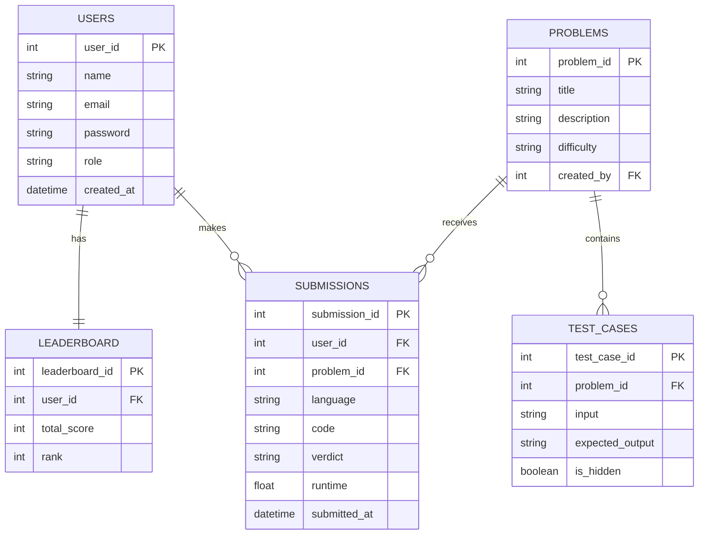

# ER Diagram – CodeForge

```mermaid
erDiagram

USERS {
    int user_id PK
    string name
    string email
    string password
    string role
    datetime created_at
}

PROBLEMS {
    int problem_id PK
    string title
    string description
    string difficulty
    int created_by FK
}

TEST_CASES {
    int test_case_id PK
    int problem_id FK
    string input
    string expected_output
    boolean is_hidden
}

SUBMISSIONS {
    int submission_id PK
    int user_id FK
    int problem_id FK
    string language
    string code
    string verdict
    float runtime
    datetime submitted_at
}

LEADERBOARD {
    int leaderboard_id PK
    int user_id FK
    int total_score
    int rank
}

USERS ||--o{ SUBMISSIONS : makes
PROBLEMS ||--o{ TEST_CASES : contains
PROBLEMS ||--o{ SUBMISSIONS : receives
USERS ||--|| LEADERBOARD : has
```
