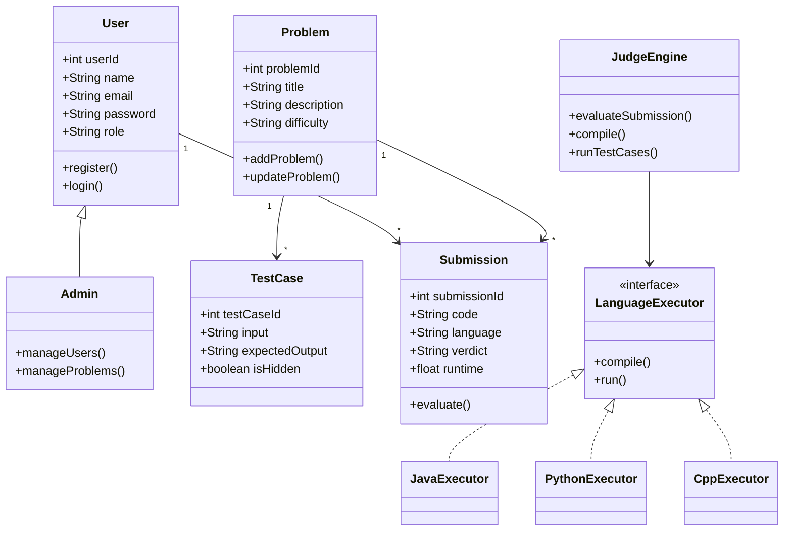

# Class Diagram – CodeForge

```mermaid
classDiagram

class User {
    +int userId
    +String name
    +String email
    +String password
    +String role
    +register()
    +login()
}

class Admin {
    +manageUsers()
    +manageProblems()
}

User <|-- Admin

class Problem {
    +int problemId
    +String title
    +String description
    +String difficulty
    +addProblem()
    +updateProblem()
}

class TestCase {
    +int testCaseId
    +String input
    +String expectedOutput
    +boolean isHidden
}

class Submission {
    +int submissionId
    +String code
    +String language
    +String verdict
    +float runtime
    +evaluate()
}

class JudgeEngine {
    +evaluateSubmission()
    +compile()
    +runTestCases()
}

class LanguageExecutor {
    <<interface>>
    +compile()
    +run()
}

class JavaExecutor
class PythonExecutor
class CppExecutor

LanguageExecutor <|.. JavaExecutor
LanguageExecutor <|.. PythonExecutor
LanguageExecutor <|.. CppExecutor

User "1" --> "*" Submission
Problem "1" --> "*" TestCase
Problem "1" --> "*" Submission
JudgeEngine --> LanguageExecutor
```
