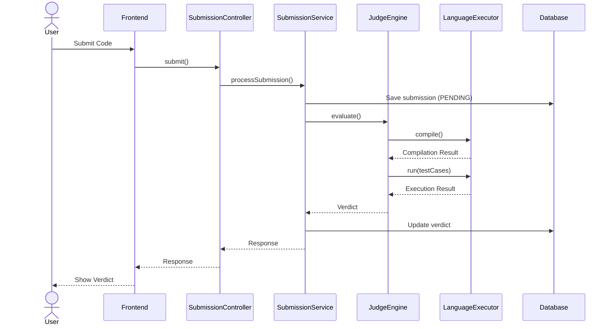

# Sequence Diagram – Code Submission Flow

```mermaid
sequenceDiagram

actor User
participant Frontend
participant SubmissionController
participant SubmissionService
participant JudgeEngine
participant LanguageExecutor
participant Database

User->>Frontend: Submit Code
Frontend->>SubmissionController: submit()
SubmissionController->>SubmissionService: processSubmission()

SubmissionService->>Database: Save submission (PENDING)

SubmissionService->>JudgeEngine: evaluate()

JudgeEngine->>LanguageExecutor: compile()
LanguageExecutor-->>JudgeEngine: Compilation Result

JudgeEngine->>LanguageExecutor: run(testCases)
LanguageExecutor-->>JudgeEngine: Execution Result

JudgeEngine-->>SubmissionService: Verdict

SubmissionService->>Database: Update verdict

SubmissionService-->>SubmissionController: Response
SubmissionController-->>Frontend: Response
Frontend-->>User: Show Verdict
```
