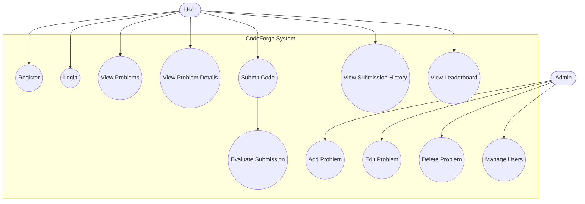

# Use Case Diagram – CodeForge

```mermaid
flowchart TD

User([User])
Admin([Admin])

subgraph CodeForge System
    UC1((Register))
    UC2((Login))
    UC3((View Problems))
    UC4((View Problem Details))
    UC5((Submit Code))
    UC6((View Submission History))
    UC7((View Leaderboard))
    UC8((Evaluate Submission))
    UC9((Add Problem))
    UC10((Edit Problem))
    UC11((Delete Problem))
    UC12((Manage Users))
end

User --> UC1
User --> UC2
User --> UC3
User --> UC4
User --> UC5
User --> UC6
User --> UC7

UC5 --> UC8

Admin --> UC9
Admin --> UC10
Admin --> UC11
Admin --> UC12
```
